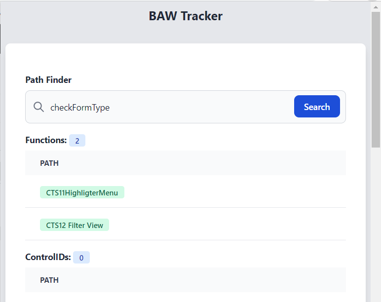
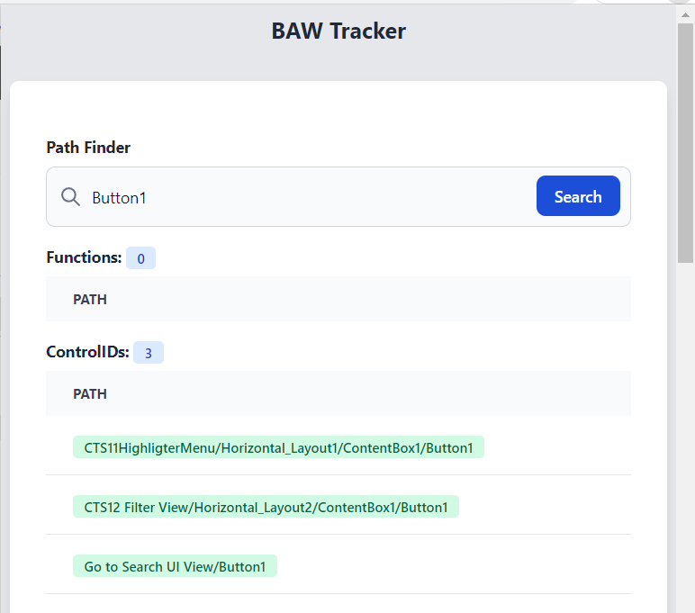
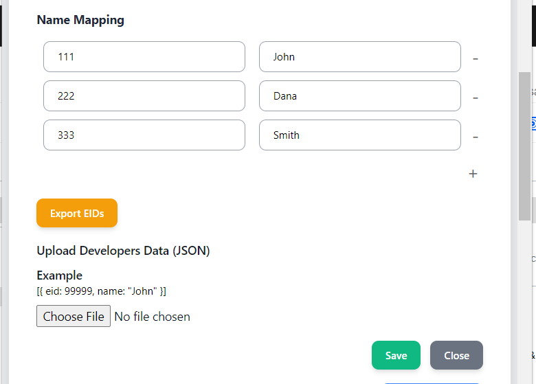
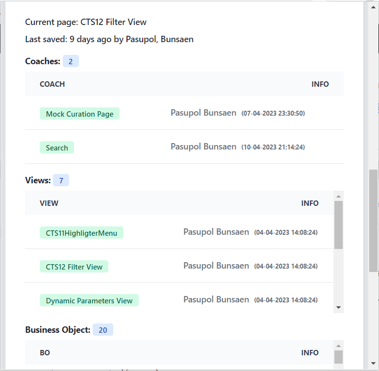

# List of the features

- Map EID with Naming: Create a mapping between EID (Employee ID) and their corresponding names. This will help to identify employees by their names instead of their EIDs.

- Upload/Download EIDs as a JSON File: Allow users to upload and download EIDs in a JSON file format.

- Check Latest Save at Once: Show the date and time when the latest EIDs JSON file was saved.

- List of Coach, View, Services, Business Object: Show the list of Coach, View, Services, Business Objects and show number of items of each option.
- Path Finder:  Advance Search with function name or controlId and will representing the path. The path includes the names of all parent layout items.